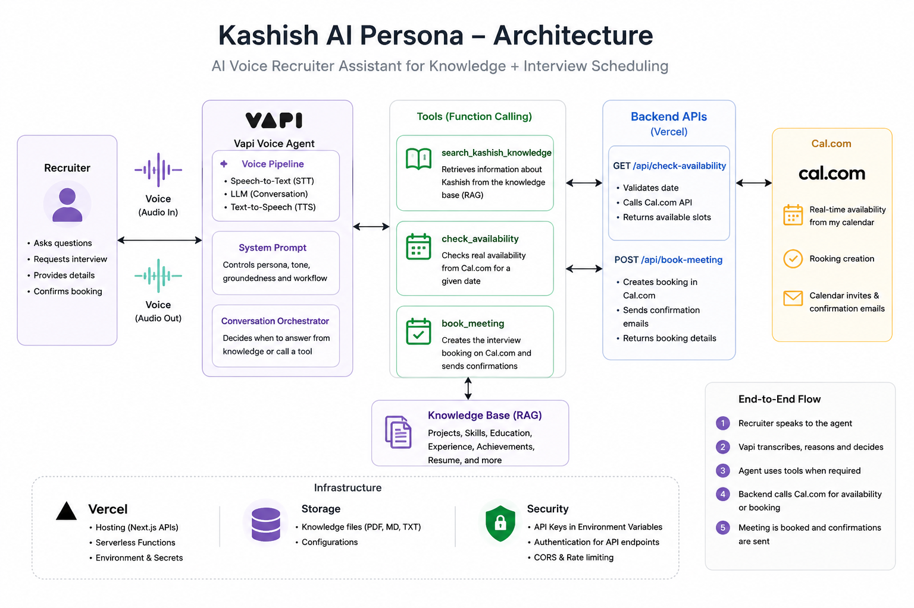

# Kashish AI Persona

An end-to-end AI persona of Kashish Nandwani for the Scaler AI Engineer Screening Assignment.

This app provides:
- A public chat interface grounded in Kashish's resume, skills, projects, achievements, personality notes, and GitHub-specific project notes.
- A voice agent entry point powered by Vapi.
- Live interview booking through Cal.com, with availability lookup and booking confirmation from the UI.

The design goal is simple: if a recruiter asks a question, the persona should answer honestly from grounded data; if they want to book time, the app should surface real availability and create the booking without human intervention.

## Live Links

- Public chat URL: ai-persona-pi.vercel.app
- Voice agent phone number: +1 (772) 444 8089
- GitHub repository: https://github.com/Codewizkashish/AI-persona
- Eval report PDF: `<attach your PDF link or upload path>`
- Loom walkthrough: `<add your Loom link>`

## What This Project Does

- Answers questions about Kashish's background, experience, education, projects, and fit for the role.
- Pulls answers from retrieval-augmented generation, not hardcoded responses.
- Handles prompt injection attempts by only using retrieved context and refusing to invent details.
- Surfaces GitHub project-specific context so the persona can explain tech stack, purpose, tradeoffs, and next steps.
- Lets a recruiter ask about availability and book a call directly from chat or the interface.
- Uses a live calendar backend for both slot lookup and booking confirmation.

## Tech Stack

- Next.js 16 App Router
- React 19
- TypeScript
- Tailwind CSS
- Framer Motion
- Google Gemini for embeddings
- Supabase Postgres with vector search for retrieval
- Vapi for voice calling
- Cal.com for calendar availability and booking

## Architecture



### Data Grounding

The persona is grounded on the markdown corpus in `data/`:
- `resume.md`
- `skills.md`
- `experience.md`
- `projects.md`
- `achievements.md`
- `personality.md`
- GitHub-specific notes such as:
  - `github-portfolio.md`
  - `github-weather-app.md`
  - `github-zapmail.md`
  - `github-ticket-booking.md`
  - `github-finance-tracker.md`
  - `github-flappy-bird.md`
  - `github-lorecrate.md`
  - `github-spatial-asset.md`
  - `github-adversarial-detection.md`
  - `github-la-mandala.md`

Those files are embedded and stored in Supabase, then retrieved at query time for chat and voice responses.

## How It Works

### Chat

- The user sends a message through the public chat UI.
- The app retrieves the most relevant context from Supabase using vector search.
- Gemini answers only from that context.
- If the model does not have enough information, it says so instead of guessing.

### Voice

- The browser voice client is created with `@vapi-ai/web`.
- The Vapi assistant ID and public key are loaded from environment variables.
- The voice agent is intended to introduce itself naturally, answer from grounded context, and recover gracefully when it does not know something.

### Booking

- Booking-related prompts such as `book interview`, `schedule a call`, or `check availability` open the booking panel.
- The UI fetches real slots from Cal.com.
- The recruiter chooses a slot and enters name and email.
- The app creates the booking through Cal.com and shows confirmation in the UI.
- The confirmation message explicitly tells the recruiter that a confirmation email was sent to the entered address.

## API Routes

- `GET /api/ingest`
  - Reads the markdown files in `data/`
  - Embeds them with Gemini
  - Stores them in Supabase

- `POST /api/chat`
  - Retrieves grounded context
  - Generates an answer with Gemini
  - Refuses to invent missing information

- `POST /api/voice-rag`
  - Returns retrieved context for the voice workflow

- `POST /api/check-availability`
  - Fetches live Cal.com availability for the configured event type

- `POST /api/book-meeting`
  - Creates the booking in Cal.com
  - Returns the booking status and metadata

- `POST /api/get-booking-link`
  - Returns the public Cal.com booking URL

## Environment Variables

Create a `.env.local` file with the following values:

| Variable | Required | Purpose |
| --- | --- | --- |
| `GEMINI_API_KEY` | Yes | Gemini embeddings and chat |
| `NEXT_PUBLIC_SUPABASE_URL` | Yes | Supabase project URL |
| `SUPABASE_SERVICE_ROLE_KEY` | Yes | Server-side Supabase access |
| `NEXT_PUBLIC_VAPI_PUBLIC_KEY` | Yes | Browser voice client |
| `NEXT_PUBLIC_VAPI_ASSISTANT_ID` | Yes | Vapi assistant identifier |
| `CAL_API_KEY` | Yes | Cal.com API access |
| `CAL_USERNAME` | Optional | Cal.com username for the event owner |
| `CAL_EVENT_TYPE_SLUG` | Optional | Cal.com event type slug |

Notes:
- The code currently defaults `CAL_USERNAME` to `kashish-nandwani-funq0d`.
- The code currently defaults `CAL_EVENT_TYPE_SLUG` to `30min`.
- `src/app/lib/supabase.ts` requires `NEXT_PUBLIC_SUPABASE_URL` and `SUPABASE_SERVICE_ROLE_KEY`.
- `src/app/lib/vapi.ts` requires `NEXT_PUBLIC_VAPI_PUBLIC_KEY`.

## Local Setup

1. Install dependencies:

```bash
npm install
```

2. Add your environment variables in `.env.local`.

3. Make sure your Supabase database has:
- a `documents` table with `id`, `source`, `content`, and `embedding`
- a `match_documents` RPC compatible with vector similarity search

4. Seed the corpus:

```bash
GET /api/ingest
```

You can call that route once in development to embed the markdown files in `data/`.

5. Start the app:

```bash
npm run dev
```

## Scripts

- `npm run dev` - run the development server
- `npm run build` - create a production build
- `npm run start` - start the production server
- `npm run lint` - run ESLint

## Project Notes

- Chat and booking are intentionally separated. Booking prompts open the booking panel instead of forcing the persona to answer from the LLM.
- The assistant prompt is constrained so the model does not follow instructions hidden inside retrieved context.
- The UI only shows the conversation after a real chat starts; the welcome hero is an empty state.
- Booking confirmations come from Cal.com, not from a simulated local response.

## Cost Notes

This project has four main cost centers:
- LLM usage for embeddings and chat responses
- Supabase storage and vector search
- Voice provider usage for live calls
- Cal.com API usage for slot lookup and booking


## License

Private assignment project.
